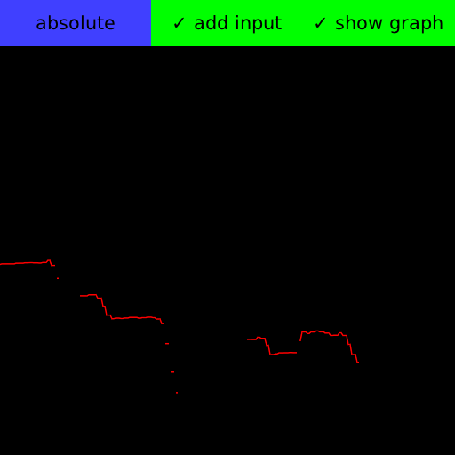

Outotune
========

An opensource harmoniser implementation for LV2 and VST leveraging the [DISTRHO
Plugin Framework][dpf] and the [WORLD speech analysis, manipulation and synthesis system][world]

[dpf]: https://github.com/DISTRHO/DPF
[world]: https://github.com/mmorise/World

What is it?
-----------

Outotune has been inspired by Jacob Collier's harmonizer, which can be seen in
action [here][wtf-harmoniser] or [here][hide-and-seek].

[wtf-harmoniser]: https://www.youtube.com/watch?v=DnpVAyPjxDA
[hide-and-seek]: https://www.youtube.com/watch?v=m7_1HUEvieE

It allows you to become a one-man choir by analysing your voice and
resynthesizing it at different pitches. It is controlled by MIDI, which
basically means you can sing and accompany yourself by playing chords on your
keyboard, and get a full choir of yous. 

See [Technical details](plugins/outotune/README.md) for more detailed description and documentation.

Why the name?
-------------

Originally, Outotune was meant to be an opensource Autotune/Melodyne
implementation, but it evolved into a harmoniser. Outotune comes from "Out o'
tune", which is pretty self-explanatory.

Dependencies
------------

* Basic C++ development packages: `g++`, `make`, `pkg-config`
* FFTW3 for the WORLD speech analysis and synthesis system
* JACK for the standalone JACK application (optional)
* OpenGL for UI (optional)

For example on Debian, install `libfftw3-dev libgl-dev libjack-dev`.

Building on platforms other than Linux is possible, but not tested.

Building and running
--------------------

First ensure that you have git submodules initialised by running

	git submodule init
	git submodule update

Also make sure you have all the needed dependencies installed (see above).

Then simply cd to the correct directory and run make:

	cd plugins/outotune
	make

By default, make will build outotune for all the supported plugin formats, this
currently means LV2, VST2 and a stand-alone JACK executable.

Other useful commands are:

- `make install`: installs the plugins to home directory
- `make run`: runs the JACK standalone executable
- `make clean`, `make clean-all`: cleans the build products, the latter also cleans in the submodules
- `make uninstall`: removes the files installed by `make install`

Usage
-----

Outotune has 3 ports: mono input, MIDI input and mono output. The set of
currently active notes is maintained by listening to MIDI `Note On` and `Note
Off` events. In each period, Outotune analyses the the audio in the input
buffer, synthesizes a voice for each active note, and muxes them into a single
output. In the LV2 plugin, the instantaneous estimated fundamental frequency
is available as an output parameter `pitch`.

### Modes

Outotune has two modes which control how the MIDI events are interpreted:

* **Absolute mode.** For each active note `n` (corresponding to the MIDI event
  `Note On n`), a voice is synthesized with the pitch corresponding to the note
  `n`. This emulates the functionality of the original harmonizer.

* **Relative mode.** Each active note `n` is interpreted relative to the
  reference note `r = 60` (corresponds to middle C). Let `p` be the
  instantaneous pitch of the input signal. Then the synthesized voice has pitch
  `p + (n - r)`. For example, playing `n = 72` (a C one octave above middle C)
  results in the input voice being shifted up by one octave.

### GUI

The GUI consists of two parts: frequency graph and a top bar.

The frequency graph shows the estimated pitch as a function of time. The
estimated pitch is shown in red, black areas represent the places where no
pitch was detected.

The top bar contains three clickable toggles for controlling the application.
Each of these toggles can also be triggered by a keyboard shortcut.

* **absolute/relative** mode toggle (`m`): switches between absolute and relative mode.
* **add input** (`i`): whether to include the original input in the output (besides
  the synthesized voices) or not.
* **show graph** (`g`): show or hide the graph.

Known limitations
-----------------

Currently, Outotune is computationally expensive. WORLD, the underlying speech
analysis and synthesis system does not seem to be optimised for our workflow –
in fact, real-time analysis is not officially supported (although real-time
synthesis is). This may be improved by refactoring WORLD, mainly by reducing
repetitive allocations and making better use of FFTW3 plans. Potential
improvements can also be made by reducing the amount of data WORLD has to
compute in each period.

Direct result of this is latency. For small enough buffer sizes, reducing the
buffer size does not substantially reduce the work done in one period, which
effectively means the smaller the buffer size, the more computationally
expensive Outotune becomes. Latency is then directly determined by the smallest
buffer size with which Outotune can still run smoothly on the machine.

